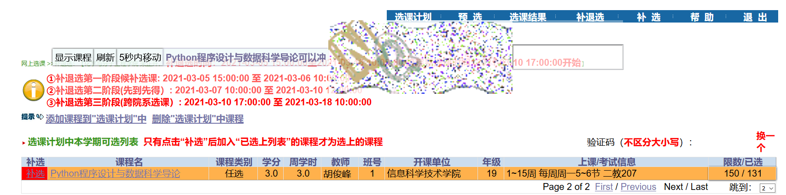

# PKUElectEnhancement  
> 针对选课网界面的优化策略。  
> 注意：本策略不干预刷课流程中由用户触发的操作。即不打算开发自动刷新与自动补选功能。  
  
> 缓慢更新中，预期是半年一更。  

> 文件：可以直接使用bundle.js，或者先运行zzz.js，后运行ElectEnhancement.js，代码是一样的。请使用可运行用户脚本/javascript的浏览器，并复制代码。  
> 2021.09更新了ElectEnhancement2021.9.js  

效果图：

  
**2020/2春季学期**  
> 增加了淡化与隐藏功能  
> 使用方法：PC端，使用油猴等脚本插件，增加一个脚本。网址填elective.pku.edu.cn，内容为js文件内容。移动端推荐能使用脚本的浏览器，比如via。  
> isHidden控制是否隐藏，1：隐藏，0：淡化  
  
**2020/9秋季学期**  
> 编写了选课页面改进的脚本auto.js  
> 使用方法：  
>> 顶端显示/隐藏人数已满的课程和不需要的课程  
>> 点击课程名可以添加需要的课程，不提供删除按钮，只需清空浏览器数据即可  
>> 取消跳转功能：点击补选后无论结果如何都不跳转，以便于继续选课  
  
**2021/3春季学期**
> 因为选课网增加了一个函数，而且把验证码变成了gif动图（虽然但是，与这个项目无关），所以重写了代码。  
> 使用方法：添加两个脚本，一个是zzz.js，另一个是ElectEnhancement.js，如果是油猴插件，则需保证zzz先运行。  
> 现在只需要点击图片，就可以刷新。  
> 选课成功后会立即返回上一页（不刷新），以便快速抢课。  
> 选课失败后会立即退出并重新登录。为了方便自动登录，请在ElectEnhancement脚本中找到pku_user_name与pku_user_password，在双引号中填写用户名和密码。  
> 可以在电脑端自由移动半透明面板。  
> 自动保存数据。  
> 想选某课，可以单击课程所在行的**人数**，其id会自动记录下来，同时底色变橙；再次单击就可以删除某课(此时底色不变白)。  
> 点击显示和隐藏按钮，能剔除不需要的课。  
> 一旦找到想要的、能补选的课，补选按钮将标记为红色，同时会通知最后找到的课。              
> 输入验证码后会自动寻找列表中第一节想要的课补选。        
  
**2021/9秋季学期**  
> 修改了一些细节，使表格显示得舒服一些。  
> 增加**紧凑**与**展开**按钮，提供两种视图。  
> 根据iaaa.的逻辑重写了**重登**按钮的逻辑，如果填写了用户名和密码则可以由脚本代理登录，直接访问elective.而不需要通过iaaa.的网页端手动登录跳转。  
> 根据源文件，添加了昌平吉利校区课程的提示。
> 修正了补选的逻辑（以前我搞错了）。
> 为添加课程编写了自动提交的逻辑，如果不操作，两秒钟之后会自动为你提交表单。
> 未实现的功能：跳转树洞。原因：浏览器禁止为键盘事件dispatchEvent，使我无法模拟用户操作。而树洞的业务逻辑相对复杂，难以找到某个函数入口。
> 未实现的功能：筛选课程。原因：ctrl+f可以略微代替一下。

欢迎提意见  
